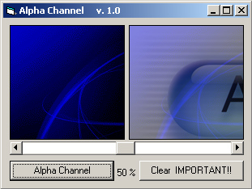



## Alpha Channel

### Description

A simple alpha channel. x% Transparent. See ScreenShot!
 
### More Info
 

             |
---                |---
**Submitted On**   |2001-08-08 15:38:22
**By**             |[FCS](https://github.com/Planet-Source-Code/PSCIndex/blob/master/ByAuthor/fcs.md)
**Level**          |Intermediate
**User Rating**    |5.0 (20 globes from 4 users)
**Compatibility**  |VB 4\.0 \(32\-bit\), VB 5\.0, VB 6\.0
**Category**       |[Graphics](https://github.com/Planet-Source-Code/PSCIndex/blob/master/ByCategory/graphics__1-46.md)
**World**          |[Visual Basic](https://github.com/Planet-Source-Code/PSCIndex/blob/master/ByWorld/visual-basic.md)
**Archive File**   |[Alpha Chan249908202001\.zip](https://github.com/Planet-Source-Code/fcs-alpha-channel__1-26408/archive/master.zip)

